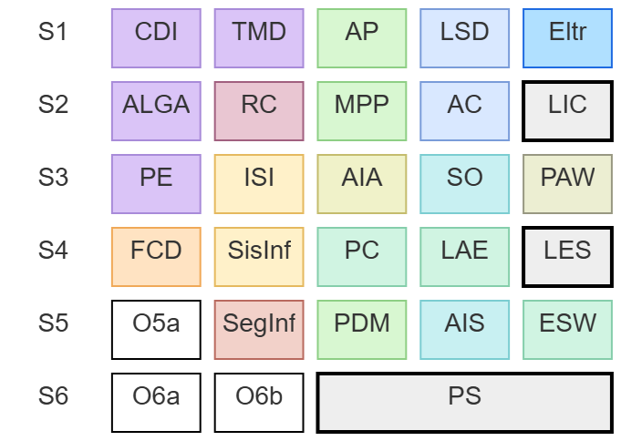

## ISEL - Licenciatura em Engenharia Informática e de Computadores

**NOTA:** Este é um exercício pessoal sobre o plano de estudos da LEIC. **Não** se trata de informação oficial *nem* é sequer um documento de trabalho institucional.
 

---

### Distribuição de Créditos por Áreas Científicas

| Área Científica                          | Sigla | ECTS Obrigatórios | ECTS Optativos |
| ---------------------------------------- | :---: | :---------------: | :------------: |
| Matemática                               |  MAT  |         24        |      0–12      |
| Engenharia Informática e de Computadores |   IC  |        132        |      0–12      |
| Engenharia Eletrónica e Telecomunicações |   ET  |         6         |      0–12      |
| Competências Transversais                |   CT  |         0         |      6–18      |
| **Total**                                |   —   |      **162**      |     **18**     |

---

## Plano de Estudos

### 1.º Ano

#### 1.º Semestre

| Unidade Curricular             | Área | Horas Totais | ECTS |
| ------------------------------ | :--: | :----------: | :--: |
| Cálculo Diferencial e Integral |  MAT |      162     |   6  |
| Tópicos de Matemática Discreta |  MAT |      162     |   6  |
| Lógica e Sistemas Digitais     |  IC  |      162     |   6  |
| Programação                    |  IC  |      162     |   6  |
| Eletrónica                     |  ET  |      162     |   6  |

#### 2.º Semestre

| Unidade Curricular                        | Área | Horas Totais | ECTS |
| ----------------------------------------- | :--: | :----------: | :--: |
| Álgebra Linear e Geometria Analítica      |  MAT |      162     |   6  |
| Metodologias e Paradigmas da Programação  |  IC  |      162     |   6  |
| Arquitetura de Computadores               |  IC  |      162     |   6  |
| Laboratório de Informática e Computadores |  IC  |      162     |   6  |
| Redes de Computadores                     |  IC  |      162     |   6  |

---

### 2.º Ano

#### 3.º Semestre

| Unidade Curricular                      | Área | Horas Totais | ECTS |
| --------------------------------------- | :--: | :----------: | :--: |
| Probabilidade e Estatística             |  MAT |      162     |   6  |
| Princípios de Arquitetura Web           |  IC  |      162     |   6  |
| Introdução aos Sistemas de Informação   |  IC  |      162     |   6  |
| Sistemas Computacionais                 |  IC  |      162     |   6  |
| Algoritmos para Inteligência Artificial |  IC  |      162     |   6  |

#### 4.º Semestre

| Unidade Curricular                    | Área | Horas Totais | ECTS |
| ------------------------------------- | :--: | :----------: | :--: |
| Fundamentos de Ciência de Dados       |  IC  |      162     |   6  |
| Laboratório de Engenharia de Software |  IC  |      162     |   6  |
| Linguagens e Ambientes de Execução    |  IC  |      162     |   6  |
| Programação Concorrente               |  IC  |      162     |   6  |
| Sistemas de Informação                |  IC  |      162     |   6  |

---

### 3.º Ano

#### 5.º Semestre

| Unidade Curricular                    |     Área     | Horas Totais | ECTS |
| ------------------------------------- | :----------: | :----------: | :--: |
| Engenharia de Sistemas Web            |      IC      |      162     |   6  |
| Programação em Dispositivos Móveis    |      IC      |      162     |   6  |
| Segurança Informática                 |      IC      |      162     |   6  |
| Arquitetura e Implantação de Sistemas |      IC      |      162     |   6  |
| Opção 5A                              | MAT/IC/ET/CT |      162     |   6  |

#### 6.º Semestre

| Unidade Curricular  |     Área     | Horas Totais | ECTS |
| ------------------- | :----------: | :----------: | :--: |
| Projeto e Seminário |      IC      |      486     |  18  |
| Opção 6A            | MAT/IC/ET/CT |      162     |   6  |
| Opção 6B            | MAT/IC/ET/CT |      162     |   6  |

---

#### Opções 5A (excepto CT)

| Unidade Curricular                  | Área  | Horas Totais | ECTS |
| ----------------------------------- | :---: | :----------: | :--: |
| Aprendizagem Automática e Profunda  |  IC   |      162     |   6  |
| Introdução à Compressão de Dados    |  IC   |      162     |   6  |
| Lógica e Computação                 |  IC   |      162     |   6  |
| Redes de Internet                   |  IC   |      162     |   6  |
| Sistemas Embebidos                  |  IC   |      162     |   6  |
| Controlo de Qualidade e Fiabilidade |  MAT  |      162     |   6  |
| Introdução à Estatística Bayesiana  |  MAT  |      162     |   6  |
| Investigação Operacional            |  MAT  |      162     |   6  |

#### Opções 5A (CT)

| Unidade Curricular                  | Área | Horas Totais | ECTS |
| ----------------------------------- | :--: | :----------: | :--: |
| Economia e Gestão de Projeto        |  CT  |      162     |   6  |
| Gestão e Avaliação de Projetos      |  CT  |      162     |   6  |
| Gestão de Equipamentos Médicos      |  CT  |      162     |   6  |
| Gestão da Qualidade em Saúde        |  CT  |      162     |   6  |
| Sistemas de Gestão                  |  CT  |      162     |   6  |
